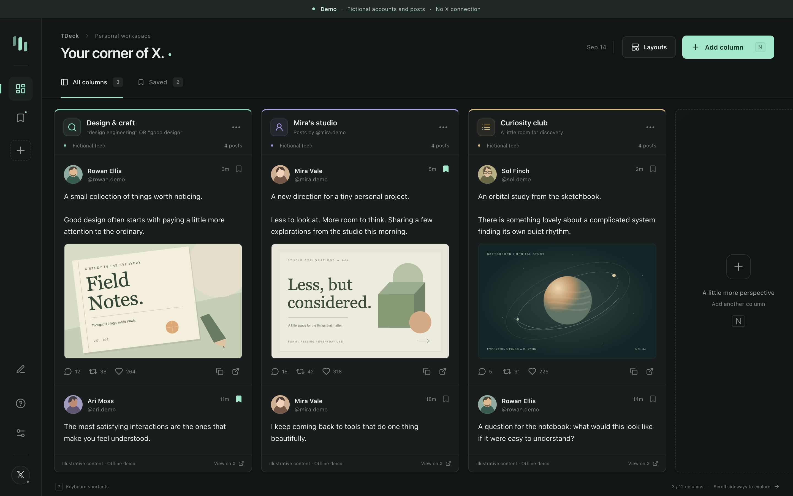

# TDeck

A focused, locally stored multi-column workspace for X. Made for Chrome and Brave with Manifest V3.



*The screenshot shows the actual dashboard with fictional accounts and posts. The demo does not connect to X.*

## Install

Download `tdeck-0.1.0.zip` from the [latest release](https://github.com/Hamid-K/TDeck/releases/latest), extract it to a permanent folder, and load that folder with **Load unpacked** on `brave://extensions` or `chrome://extensions` (enable **Developer mode** first). Then open TDeck, sign in to X in the same browser profile, and click **Connect X**. Use the attached extension ZIP, not GitHub's automatically generated source-code archive.

To build from source instead:

1. Run `npm ci` and `npm run build` (Node.js 22 or later).
2. Open `brave://extensions` or `chrome://extensions` and enable **Developer mode**.
3. Choose **Load unpacked** and select this project's `dist` folder.
4. Click TDeck's extension icon, or press **Alt+Shift+D**, to open the dashboard.
5. Sign in to X in the same browser profile, create your columns, and click **Connect X**.

TDeck opens a separate, unfocused source window containing ordinary X pages. Keep this window open and unminimized. TDeck selects each source inside that window while your dashboard keeps focus; X needs a visible source page to render avatars and images. Columns refresh in turn, so initial connection can take a little longer when you add several at once. TDeck leaves the source window alone while you are inspecting it and never takes over your existing X tabs. Removing a column closes only its verified source tab. Closing a source stops its updates; refresh the column to reconnect it.

After updating the code, rebuild and click **Reload** on TDeck's extension card. Reopen TDeck and refresh the columns; an existing source page may also need a reload for the updated content script.

## Your columns

- **Search:** any normal X query, including keywords, quoted phrases, `OR`, exclusions, `from:`, hashtags, and languages supported by X search. TDeck uses Latest results.
- **Account:** a handle such as `@NASA` or an X profile URL. Uses Latest search for posts by that account.
- **List:** choose an existing list from **Your X lists**, including private lists available to your account. You can also paste a numeric list ID or `https://x.com/i/lists/…` URL. Discovery uses your own Lists page, excludes X's recommendations, and distinguishes duplicate names by membership counts. Selecting a list opens its ordinary native card in a temporary tab to resolve its URL; it does not subscribe, pin, or edit the list.

Each column has its own scroll position, title, accent, width, refresh interval, pause control, local media/reply/keyword filters, and older-post loading. Drag its handle or use **Move left/right** in its menu to reorder it. Up to 12 columns are supported. A new post inserts at the top automatically; if you are reading farther down, the dashboard keeps the visible post in place. Queued arrivals can be enabled in settings.

The sidebar provides saved posts, settings, and keyboard help. Saved posts are local to TDeck, separate from X bookmarks. Images open in a keyboard-accessible lightbox. Reply, like, repost, video, and compose links open X to complete the action. Copy-link and local-save controls work inside TDeck.

Settings include light/dark/system appearance, comfortable/compact density, font size, media previews, and arrival mode. JSON export/import transfers column configuration and preferences; it does not export your account session or cached posts.

## Saved layouts

Your current workspace saves automatically on this device. Use **Layouts** in the dashboard header to save a named snapshot of your column sources, order, widths, filters, and preferences. Save up to 20 layouts, restore one, rename it, or explicitly update it with your current view. Restore, overwrite, and delete actions ask for confirmation. Editing your current workspace does not silently overwrite a saved snapshot.

Layouts survive browser and extension restarts in the same profile. They do not contain posts, bookmarks, or login sessions; restoring a layout keeps your local bookmarks. JSON export/import applies to the current workspace, not the entire named-layout library.

## Updates and limits

This is periodically refreshed X search, not an exhaustive realtime stream. TDeck only sees posts that X renders for the signed-in account. X's own search filtering, availability, visibility rules, and limits still apply. Fast-moving searches may produce more posts between refreshes than a captured page contains.

The default column interval is two minutes; the minimum is one minute. Requests are staggered across columns and errors back off. An X rate-limit response pauses searches for a cooldown. Cached posts stay visible during failures. Global or per-column pause stops new refresh work; an already-running page request may finish.

Each source page uses browser memory. Each column retains up to 180 recent posts; when that cache is full, **Continue on X** opens the rest of the source. Browser sleep, minimizing the source window, freezing, an expired login, or an X markup change can interrupt updates. TDeck shows the last successful check and an actionable source state. Keep the source window available, switch back to the dashboard after inspecting X, and refresh a column if it gets stuck. Status-text recognition currently expects X's English interface.

## Privacy and permissions

- **X site access:** read rendered posts from X search/list source pages. List discovery briefly opens Home to read the signed-in profile link, then reads that profile's own Lists page. No cookie access, password collection, account-token storage, private-endpoint requests, or authentication export.
- **Storage:** save columns, preferences, local bookmarks, bounded post caches, and source-tab ownership on this device.
- **Alarms:** wake the background worker for scheduled refreshes.
- **Tab groups:** resume source tabs from older TDeck builds that used a collapsed group. New sources use the dedicated window. No access to unrelated website content.

No server, tracking, telemetry, or developer API key. All extension code is bundled locally. Post text is rendered as text; media URLs are restricted to X's image host. Post images load from `pbs.twimg.com` under the browser's normal network rules.

The optional **AI Recap** feature is a later phase, not enabled in this build. Its topic-neutral, source-linked recap design is recorded in `PLAN.md`. No AI provider is connected and no column content is sent to an AI service.

## Development and verification

```sh
npm ci
npm run check
npm run preview
npm run pack
```

`preview` runs the dashboard at a local development URL in clearly labeled preview mode. It can exercise layout and configuration; it does not connect to the signed-in X session. The production build is `dist/`; `pack` also creates a ZIP in `release/` for unpacked installation or store submission preparation.

For the populated, privacy-safe screenshot demo, run `npm run preview` and open `http://127.0.0.1:5173/demo.html`. Its in-memory sample data is isolated from your saved workspace and account. Demo code is not included in the extension build.

The test suite covers untrusted DOM extraction, quote nesting, authentication/error states, bounded scrolling, settings validation, feed merging, source ownership, persistence, and background-worker races. Browser acceptance results and any remaining limitations are recorded in [VERIFICATION.md](VERIFICATION.md).

Architecture: `src/ui` renders the deck, `src/source` reads ordinary X DOM, `src/background.ts` manages source tabs and scheduling, and `src/shared` validates data and merges feeds. The worker persists state because MV3 service workers can stop between events.

Design references: [Chrome content scripts](https://developer.chrome.com/docs/extensions/develop/concepts/content-scripts), [service-worker lifecycle](https://developer.chrome.com/docs/extensions/develop/concepts/service-workers/lifecycle), [alarms](https://developer.chrome.com/docs/extensions/reference/api/alarms), [X advanced search](https://help.x.com/en/using-x/x-advanced-search), and [X search filters and limits](https://help.x.com/en/using-x/top-search-results-faqs).
